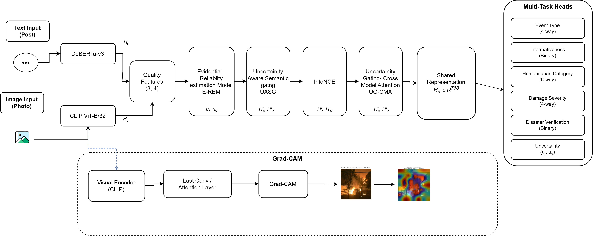

# Reliability-Aware Multimodal Disaster Understanding

<p align="center">
  <b>Reliability-Aware Multimodal Disaster Understanding Through Evidential Reliability Estimation and Uncertainty-Aware Cross-Modal Attention</b>
</p>

<p align="center">
  A multimodal deep learning framework for disaster-related social media understanding using textual and visual information.
</p>

---

## Overview

Social media provides valuable information during natural disasters through
user-generated text and images. However, such content can be noisy,
incomplete, ambiguous, or unreliable.

This project develops a reliability-aware multimodal framework that jointly
processes textual and visual information while estimating the reliability of
each modality.

The framework integrates:

* DeBERTa-v3 for text representation
* CLIP ViT-B/32 for image representation
* Quality-based reliability features
* Evidential Reliability Estimation Model (E-REM)
* Uncertainty-Aware Semantic Gating (UASG)
* InfoNCE-based cross-modal alignment
* Uncertainty Gating–Cross-Modal Attention (UG-CMA)
* Multi-task prediction
* Grad-CAM-based visual explanation

---

## Proposed Architecture

<p align="center">
  
</p>

<p align="center">
  <b>Figure 1.</b> Overview of the proposed reliability-aware multimodal disaster understanding framework.
</p>

---

## Methodology

### Text and Image Encoding

Textual information is encoded using **DeBERTa-v3**, while visual
information is encoded using **CLIP ViT-B/32**.

### Reliability Estimation

Quality features from the text and image modalities are combined with their
learned representations and processed using the **Evidential Reliability
Estimation Model (E-REM)** to estimate modality-specific reliability and
uncertainty.

### Uncertainty-Aware Semantic Gating

The estimated reliability values are used by **Uncertainty-Aware Semantic
Gating (UASG)** to regulate the contribution of each modality.

### Contrastive Alignment

**InfoNCE** is used to improve semantic alignment between corresponding
textual and visual representations.

### Cross-Modal Attention

The gated representations are processed using **Uncertainty
Gating–Cross-Modal Attention (UG-CMA)** to enable interaction between the
textual and visual modalities while considering their reliability.

### Multi-Task Learning

The shared multimodal representation is used for multiple prediction tasks:

* Event Type
* Informativeness
* Humanitarian Category
* Damage Severity
* Disaster Verification
* Uncertainty Estimation

### Explainability

**Grad-CAM** is used to generate visual explanations and highlight image
regions contributing to model predictions.

---

## Baseline Experiments

The baseline experiments evaluate the following configurations:

| Experiment | Description                    |
| ---------- | ------------------------------ |
| **B0**     | Conventional Fusion            |
| **B1**     | Vanilla EDL                    |
| **B2**     | EDL + UASG                     |
| **B3**     | E-REM + UASG                   |
| **B4**     | E-REM + Conventional Attention |

These experiments are used to study the contribution of the reliability and
attention components.

---

## Notebooks

The research notebook has been divided into **two notebooks** to separate
model training from evaluation and visualization.

### Part 1 — Data, Model Definition, and Training

[`notebook_Part1.ipynb`](Notebooks/notebook_Part1.ipynb)

Part 1 contains the complete data preparation, model definition, and training
pipeline.

It includes:

* Experimental configuration and reproducibility
* CrisisMMD dataset loading
* Train/dev/test split generation
* Data preprocessing
* Text and image quality feature extraction
* DeBERTa-v3 text encoder
* CLIP ViT-B/32 image encoder
* E-REM
* UASG
* InfoNCE alignment
* UG-CMA
* Multi-task learning
* Model training and validation
* Checkpoint generation
* Training history
* Export of artifacts required by Part 2

At the end of Part 1, the trained model and processed data are saved under:

```text
disaster_research_outputs/
├── checkpoints/
│   └── best_model.pt
│
└── data/
    ├── df_train.pkl
    ├── df_dev.pkl
    ├── df_test.pkl
    ├── label_encoders.pkl
    ├── model_config.json
    ├── history.pkl
    └── best_val_f1.json
```

These files provide the inputs required by Part 2.

---

### Part 2 — Evaluation and Visualization

[`notebook_Part2.ipynb`](Notebooks/notebook_Part2.ipynb)

Part 2 consumes the artifacts generated by Part 1 and continues the
experimental pipeline in a fresh runtime.

**Part 2 does not retrain the model.**

It loads:

* The trained `best_model.pt` checkpoint
* Processed train/dev/test dataframes
* Label encoders
* Model configuration
* Training history

The model architecture is reconstructed using the saved configuration and the
trained checkpoint is loaded before evaluation.

Part 2 contains:

* Model reconstruction
* Calibration
* Main test-set evaluation
* Comprehensive evaluation metrics
* Confusion matrices
* Uncertainty analysis
* Reliability analysis
* Grad-CAM visual explanations
* Grad-CAM faithfulness evaluation
* t-SNE representation visualization
* Ablation experiments
* Statistical significance analysis
* Single-sample inference
* Final experimental summary

The outputs generated by Part 2 include the final evaluation results,
visualizations, explanations, and other experimental artifacts required for
analysis and reporting.

---

## Notebook Execution Flow

The two notebooks must be executed sequentially.

```text
CrisisMMD Dataset
       │
       ▼
┌─────────────────────────────┐
│ Part 1                      │
│ Data + Model + Training     │
└─────────────────────────────┘
       │
       │ Saves trained model,
       │ processed datasets,
       │ configuration & history
       ▼
disaster_research_outputs/
       │
       ▼
┌─────────────────────────────┐
│ Part 2                      │
│ Evaluation + Visualization  │
└─────────────────────────────┘
       │
       ▼
Final Metrics
Confusion Matrices
Uncertainty Analysis
Grad-CAM
t-SNE
Ablation Results
Statistical Analysis
```

### Important

The outputs generated by **Part 1 are used as inputs to Part 2**.

Part 2 does not depend on Python variables remaining in memory from Part 1.
Instead, Part 1 explicitly saves the required artifacts to
`disaster_research_outputs/`, allowing Part 2 to reconstruct the required
data pipeline and model in a fresh runtime.

---

## Results

### Figures

The generated experimental figures are available in:

[`Results/figures/`](Results/figures/)

These include:

* Training and validation plots
* Confusion matrices
* Ablation visualizations
* Uncertainty/reliability visualizations
* Embedding visualizations
* Grad-CAM outputs
* Other experimental visualizations

### Metrics

Numerical experimental results are available in:

[`Results/metrics/`](Results/metrics/)

---

## Dataset

The project uses multimodal disaster-related social media data containing
textual and visual information.

The dataset is **not included in this repository**. Users should obtain the
dataset from its original source and follow its applicable terms of use.

Dataset paths should be configured in the notebooks before execution.

---

## Requirements

The main dependencies include:

```text
numpy
pandas
scipy
matplotlib
seaborn
Pillow
opencv-python
scikit-learn
tqdm
torch
torchvision
transformers
open_clip_torch
jupyter
ipykernel
```

The complete dependency list is provided in `requirements.txt`.

---

## Installation

Clone the repository:

```bash
git clone https://github.com/sivaanjan/Reliability-aware-multimodal-disaster-understanding.git
cd Reliability-aware-multimodal-disaster-understanding
```

Create a virtual environment:

```bash
python -m venv venv
```

Activate it on Windows:

```bash
venv\Scripts\activate
```

Install the dependencies:

```bash
pip install -r requirements.txt
```

Launch Jupyter:

```bash
jupyter notebook
```

---

## Running the Notebooks

### Step 1 — Run Part 1

Open:

```text
Notebooks/notebook_Part1.ipynb
```

Run the notebook from top to bottom.

Part 1 trains the proposed model and generates:

```text
disaster_research_outputs/
```

Make sure the artifact export section completes successfully.

### Step 2 — Provide Part 1 Outputs to Part 2

The complete `disaster_research_outputs/` directory must be accessible to
Part 2.

Depending on the environment:

* **Kaggle:** Save the Part 1 output and attach it as an input to Part 2.
* **Google Colab:** Keep the directory in the runtime or mount Google Drive.
* **Local environment:** Keep the directory accessible from the working
  directory or configure its path.

### Step 3 — Run Part 2

Open:

```text
Notebooks/notebook_Part2.ipynb
```

Run the notebook from top to bottom.

Part 2 loads the trained checkpoint and processed artifacts from Part 1 and
performs the remaining evaluation and visualization experiments.

---

## Repository Structure

```text
reliability-aware-multimodal-disaster-understanding/
│
├── README.md
├── requirements.txt
├── .gitignore
│
├── Notebooks/
│   ├── notebook_Part1.ipynb
│   └── notebook_Part2.ipynb
│
├── Docs/
│   └── Architecture.png
│
├── Results/
│   ├── figures/
│   └── metrics/
│
└── src/
```

---

## Author

**Siva Anjan Kumar Thota**
M.Tech Data Science
SRM University-AP
